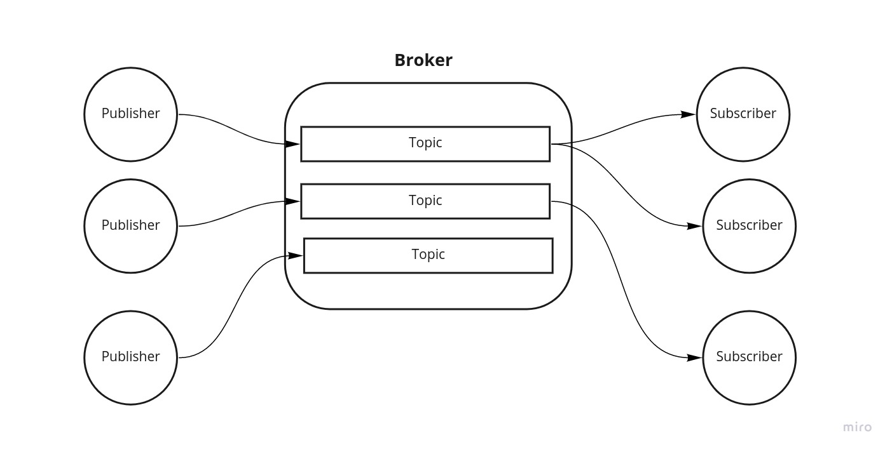

# Chiz Broker: a broker for fun 

ChizBroker is a fast and simple GRPC based implementation of kafka.
Features:
- Ready to be deployed on kubernetes
- Prometheus metrics
- Handling up to 7k publish rpcs on a single node
- All message get stored in DB

# Architecture

Broker can have several topics and each message published to certain topic will be broadcasted
to all subscribers to that topic.

## RPCs Description
- Publish Requst
```protobuf
message PublishRequest {
  string subject = 1;
  bytes body = 2;
  int32 expirationSeconds = 3;
}
```
- Fetch Request
```protobuf
message FetchRequest {
  string subject = 1;
  int32 id = 2;
}
```
- Subscribe Request
```protobuf
message SubscribeRequest {
  string subject = 1;
}
```
- RPC Service
```protobuf
service Broker {
  rpc Publish (PublishRequest) returns (PublishResponse);
  rpc Subscribe(SubscribeRequest) returns (stream MessageResponse);
  rpc Fetch(FetchRequest) returns (MessageResponse);
}
```

# How to Run it?
## docker
```shell
chmod +x run.sh
./run.sh
```
this starts grpc server on port 8086. prometheus metrics can be accessed from `:8000/metrics`
## kubernetes
```shell
cd k8
kubectl apply -f service.yml
kubectl apply -f deployment.yml
```